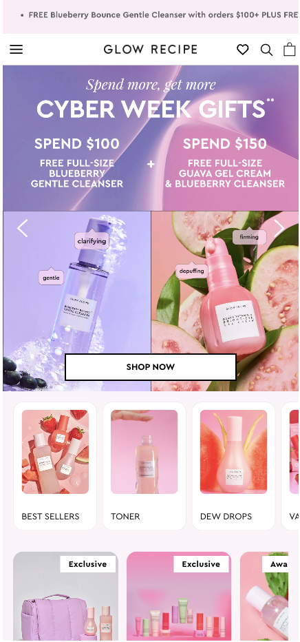
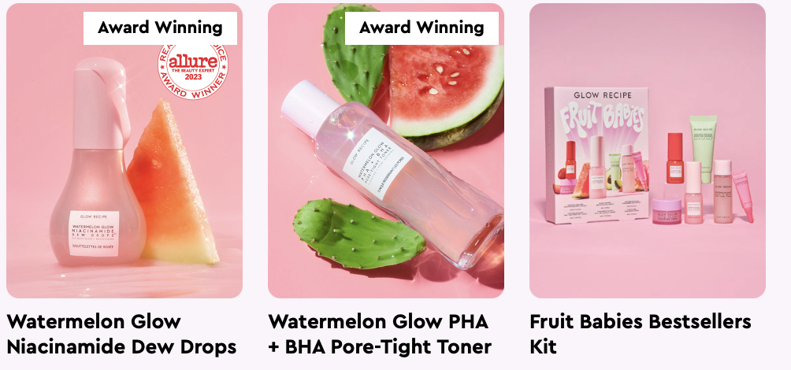
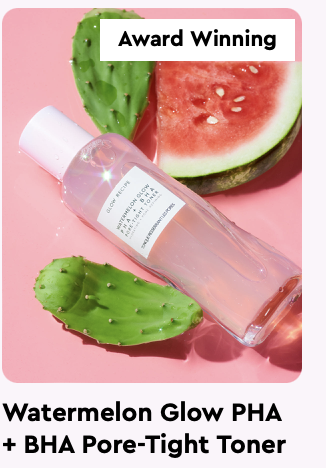
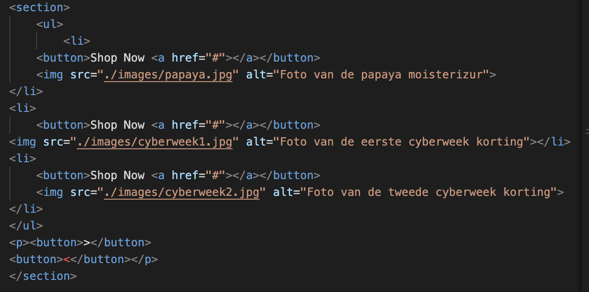
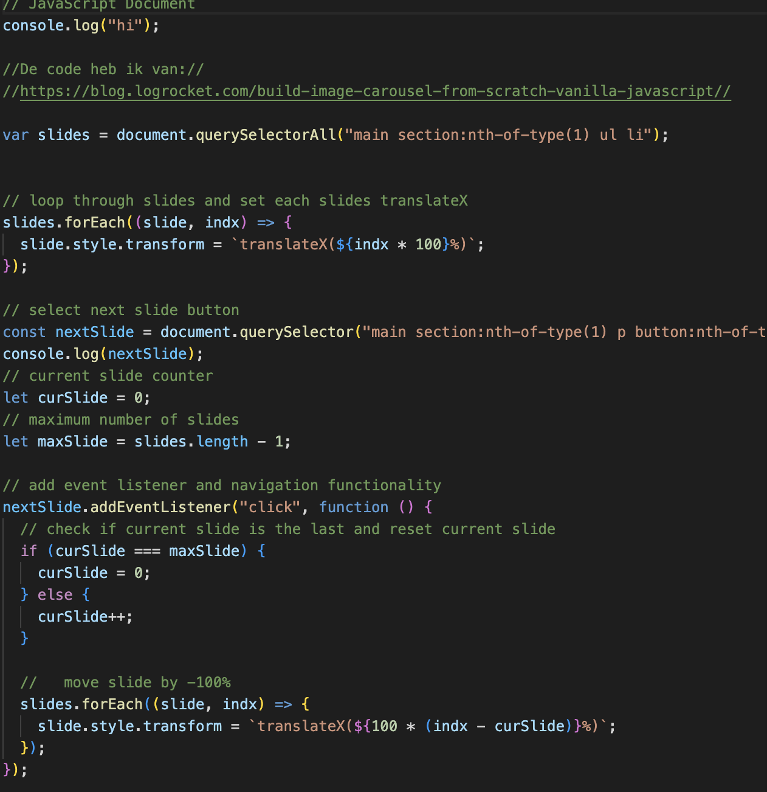
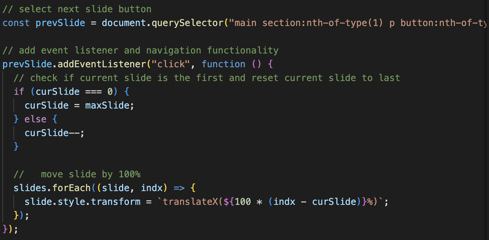
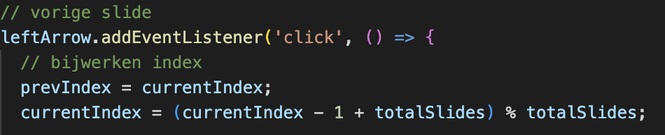
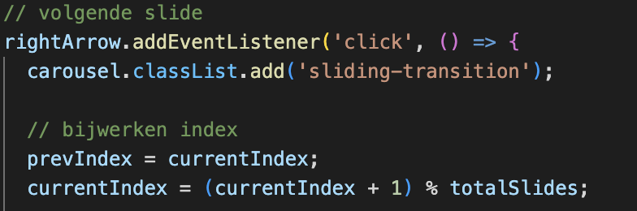
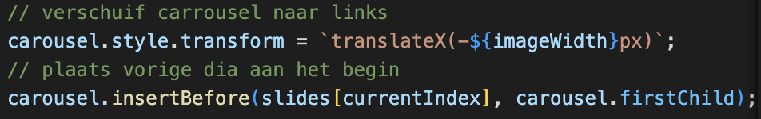
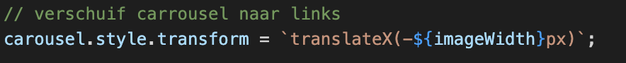

# Procesverslag
Markdown is een simpele manier om HTML te schrijven.  
Markdown cheat cheet: [Hulp bij het schrijven van Markdown](https://github.com/adam-p/markdown-here/wiki/Markdown-Cheatsheet).

Nb. De standaardstructuur en de spartaanse opmaak van de README.md zijn helemaal prima. Het gaat om de inhoud van je procesverslag. Besteedt de tijd voor pracht en praal aan je website.

Nb. Door *open* toe te voegen aan een *details* element kun je deze standaard open zetten. Fijn om dat steeds voor de relevante stuk(ken) te doen.

## Jij

  
uitwerken voor kick-off werkgroep

  ### Auteur:
  Lisa Meijers

  #### Je startniveau:
  Blauw

  #### Je focus:
  Surface plane
 

## Je website

  
uitwerken voor kick-off werkgroep

  ### Je opdracht:
  https://www.glowrecipe.com/pages/2023-holiday-gift-guide 

  #### Screenshot(s) van de eerste pagina (small screen): 
  Homepage 
  

  #### Screenshot(s) van de tweede pagina (small screen):
  About us  
  
 

## Toegankelijkheidstest 1/2 (week 1)

  
uitwerken na test in 2e werkgroep

  ### Bevindingen
Tijdens de toegankelijkheidstest van mijn website ontdekte ik veel verbeterpunten in de Glow Recipe Website.

 De marquee bovenaan de website is moeilijk over te slaan voor screenreader-gebruikers, hij herhaalt zich veel. 
 
 Ik heb een fijne tip gekregen in de les en ik overweeg de Chrome-plugin 'Colorblindly' te gebruiken. Dit zodat ik de ervaring van kleurenblinde gebruikers kan proberen te verbeteren. 
 
 Ook misten alt-attributen bij de afbeeldingen, wat belangrijk is voor screenreader met tab. Daarbij zijn sommige states bij links, buttons en forms. De a linkjes hebben geen visited state. De buttons hebben geen cursor:pointer en zijn niet dezelfde kleur wanneer je eroverheen hovert. Ook bevat de forms geen focus state. 
 
 Het ontbreken van consistente heading-levels en de onmogelijkheid om de diavoorstelling te pauzeren, vielen op.
 
  Mijn website ondersteunt nog geen dark mode, light mode, en high-contrast mode. Bovendien was er geen aangepaste ::selection kleuren toegepast op de echte website.

## Breakdownschets (week 1)

  
uitwerken na afloop 3e werkgroep

  ### de hele pagina: 
  

  ### dynamisch deel (bijv menu): 
  

  ### wellicht nog een dynamisch deel (bijv filter): 
  

## Voortgang 1 (week 2)

  
uitwerken voor 1e voortgang

  ### Stand van zaken
  Het opzetten van de pagina ging best soepel, ik had op het begin alleen wat moeite om te beginnen met opstarten van het coderen. Maar na het vele proberen en hulp vragen in de klas pakte ik het gelukkig weer snel op. Ik moest ook wel wennen aan het feit dat je 2 aparte html paginas moest maken en 3 aparte css paginas. In jaar 1 heb ik dit nooit zo gedaan, alleen vind ik het wel veel fijner om zo te werken. De regels code word zo makkelijker leesbaar en goed te onderscheiden van elkaar.

 Het werken met de marquee ging goed. Ik heb gekeken naar hoe je in de marquee een bepaalde stijling kan geven. Dit vond ik wel lastig, omdat een background color niet even makkelijk ging door de opzet van mijn marquee op het eerst. Maar na veel proberen en de structuur beter op te zetten is het uiteindelijk gelukt!

 

 

  ### Agenda voor meeting
  samen met je groepje opstellen

Lisa:

-Nav Bar
-Css paginas verschillende

Laura:

-3 buttons stijl
-Haai met nummers

Sander:

-Margin en padding
-Semantisch correct?

Kayane:

-Hamburger menu
-Javascript

  ### Verslag van meeting
  hier na afloop snel de uitkomsten van de meeting vastleggen

  - Nav menu kijken we nog even samen naar, ik en de student assistent.
  - In de marquee degene met de hoofdletters normaal schrijven.
  - 3 css paginas. Style.css voor de algemene, index.css voor de homepage en aboutus.css voor de about us pagina.
  - Hamburger menu als button in de nav. Ook met een button:active. Of doe 3 lijnen maken en geef ze een leuke animatie in javascript.

## Voortgang 2 (week 3)

  
uitwerken voor 2e voortgang

  ### Stand van zaken
  Week 3 was aangebroken, ik heb heel veel in de lessen geleerd. Deze week zijn we vooral bezig geweest met oefenen van het positioneren met elementen op de pagina. Dit was voor mij heel fijn om in codepen deze opdrachten zelf te hebben gemaakt en geforked, zodat ik kan terug kijken hoe ik deze had gemaakt en toepassen in mijn eigen website.

  

   

  Ik heb daardoor in deze text slide bar tekst bovenaan op mijn foto gekregen (De award winning label). Ook heb ik de slidebar allemaal dezelfde hoogte en breedte kunnen geven, ondaks dat de foto's groter waren. Student assistent Nina heeft mij daarmee geholpen. Ook staat de beschrijving text mooi gecentreerd onder het plaatje.

  Ik vond het alleen wel lastig om de 3 foto's bovenaan de pagina de laten sliden met een knop. 

  De code:

  HTML:

  Javascript:

  

  

Ik had best wel veel moeite met de slider. Ik had code van het internet gebruikt, waarbij de foto wel naar rechts en links slidet, alleen ging hij na de derde weer terug naar links sliden. Terwijl ik wilde dat hij alleen maar naar rechts kon sliden. Gelukkig heeft Nina mij kunnen helpen en hebben we dit samen kunnen fixen met javascript.

 In week 3 vrijdag kreeg ik feedback van Sanne, alleen had ik ook moeite dat de slider alleen werkte als de page 390px was. Als ik deze groter of kleiner maakte, haperde de transition en was de slide niet smooth. Gelukkig kon Sanne mij helpen.

 Deze code hebben wij toen geïmplementeerd:

 

 

 Dit is de window resize event. 

 

 

De eventlisteners reageren op klikken op de knoppen voor het verschuiven naar de vorige en volgende dia's. Er wordt gebruik gemaakt van CSS-transities om animaties toe te voegen. De translateX eigenschap wordt gebruikt om de dia's horizontaal te verschuiven.

  ### Agenda voor meeting
  samen met je groepje opstellen

 Lisa:

-Animatie op button ‘^’ bij kopen
-Slider bar in een loop aangeven

Laura:
-De achtergrond en afbeelding bij de h1
-Iframe stylen

Sander:
-?

Kayane:
-Footer
-Selectors

  ### Verslag van meeting
  hier na afloop snel de uitkomsten van de meeting vastleggen

  - De animatie code kijken we samen even naar, met de studentassistent. 
  - De slider bar in een loop aangeven is eigenlijk helemaal niet handig, want dan weet de gebruiker niet wanneer de producten stopt en is het eigenlijk niet toegankelijk.

## Toegankelijkheidstest 2/2 (week 4)

  
uitwerken na test in 9e werkgroep

  ### Bevindingen
  Lijst met je bevindingen die in de test naar voren kwamen (geef ook aan wat er verbeterd is):

## Voortgang 3 (week 4)

  
uitwerken voor 3e voortgang

  ### Stand van zaken
  hier dit ging goed & dit was lastig (neem ook screenshots op van delen van je website en code)

  ### Agenda voor meeting
  samen met je groepje opstellen

  | student 1      | student 2          | student 3    | student 4        |
  | ---            | ---                | ---          | ---              |
  | dit bespreken  | en dit             | en ik dit    | en dan ik dat    |
  | en dat ook nog | dit als er tijd is | nog een punt | dit wil ik zeker |
  | ...            | ...                | ...          | ...              |

  ### Verslag van meeting
  hier na afloop snel de uitkomsten van de meeting vastleggen

  - punt 1
  - punt 2
  - nog een punt
  - ...

## Eindgesprek (week 5)

  
uitwerken voor eindgesprek

  ### Je uitkomst - karakteristiek screenshots:
  

  ### Dit ging goed/Heb ik geleerd: 
  Korte omschrijving met plaatjes

  

  ### Dit was lastig/Is niet gelukt:
  Korte omschrijving met plaatjes

  

## Bronnenlijst

  
continu bijhouden terwijl je werkt

  Nb. Wees specifiek ('css-tricks' als bron is bijv. niet specifiek genoeg). 
  Nb. ChatGpT en andere AI horen er ook bij.
  Nb. Vermeld de bronnen ook in je code.

  1. bron 1
  2. bron 2
  3. ...

