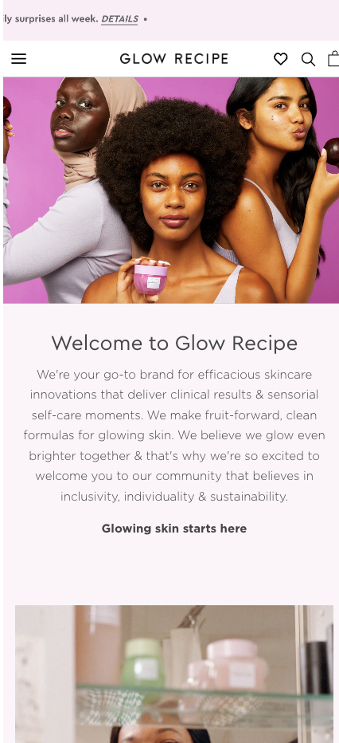

# Procesverslag
Markdown is een simpele manier om HTML te schrijven.  
Markdown cheat cheet: [Hulp bij het schrijven van Markdown](https://github.com/adam-p/markdown-here/wiki/Markdown-Cheatsheet).

Nb. De standaardstructuur en de spartaanse opmaak van de README.md zijn helemaal prima. Het gaat om de inhoud van je procesverslag. Besteedt de tijd voor pracht en praal aan je website.

Nb. Door *open* toe te voegen aan een *details* element kun je deze standaard open zetten. Fijn om dat steeds voor de relevante stuk(ken) te doen.

## Jij

  
uitwerken voor kick-off werkgroep

  ### Auteur:
  Lisa Meijers

  #### Je startniveau:
  Blauw

  #### Je focus:
  Surface plane
 

## Je website

  
uitwerken voor kick-off werkgroep

  ### Je opdracht:
  https://www.glowrecipe.com/pages/2023-holiday-gift-guide 

  #### Screenshot(s) van de eerste pagina (small screen): 
  Homepage 
  

  #### Screenshot(s) van de tweede pagina (small screen):
  About us  
  
 

## Toegankelijkheidstest 1/2 (week 1)

  
uitwerken na test in 2e werkgroep

  ### Bevindingen
  Lijst met je bevindingen die in de test naar voren kwamen:

  -De tekst aan de bovenkant in de pagina kun je niet snel weg van met de screenreader.
  -Chrome plugin, Colorblindly, kun je gebruiken om te zien hoe mensen die kleurenblind jou pagina evaren.
  -De imgs hebben geen alt attribute.
  -Headings zijn niet gebruikt om een element te introduceren.
  -De slideshow kan niet gepauzeerd worden (foto's)
  -Dark en light mode worden niet gesupport op de pagina van Glow Recipe.
  -Hetzelfde geld voor high-contrast mode.
  -Geen custom::selection colors gebruikt.

## Breakdownschets (week 1)

  
uitwerken na afloop 3e werkgroep

  ### de hele pagina: 
  

  ### dynamisch deel (bijv menu): 
  

  ### wellicht nog een dynamisch deel (bijv filter): 
  

## Voortgang 1 (week 2)

  
uitwerken voor 1e voortgang

  ### Stand van zaken
   
 Het werken met de marquee ging goed. Ik heb gekeken naar hoe je in de marquee een bepaalde stijling kan geven van 
 

  ### Agenda voor meeting
  samen met je groepje opstellen

  | Lisa           | Laura              | Sander             | Kayane           |
  | ---            | ---                | ---                | ---              |
  |Nav Bar         | 3 buttons stijl    | Margin en padding  | en dan ik dat    |
  |Css paginas?    | Haai met nummers   | Semantisch correct?| dit wil ik zeker |
  |...             | ...                | ...                | ...              |

  ### Verslag van meeting
  hier na afloop snel de uitkomsten van de meeting vastleggen

  - Nav menu kijken we nog even samen naar, ik en de student assistent.
  - In de marquee degene met de hoofdletters normaal schrijven.
  - 3 css paginas. Style.css voor de algemene, index.css voor de homepage en aboutus.css voor de about us pagina.
  - Hamburger menu als button in de nav. Ook met een button:active. Of doe 3 lijjnen maken en geef ze een leuke animatie in javascript.

## Voortgang 2 (week 3)

  
uitwerken voor 2e voortgang

  ### Stand van zaken
  hier dit ging goed & dit was lastig (neem ook screenshots op van delen van je website en code)

  ### Agenda voor meeting
  samen met je groepje opstellen

  | student 1      | student 2          | student 3    | student 4        |
  | ---            | ---                | ---          | ---              |
  | dit bespreken  | en dit             | en ik dit    | en dan ik dat    |
  | en dat ook nog | dit als er tijd is | nog een punt | dit wil ik zeker |
  | ...            | ...                | ...          | ...              |

  ### Verslag van meeting
  hier na afloop snel de uitkomsten van de meeting vastleggen

  - punt 1
  - punt 2
  - nog een punt
- ...

## Toegankelijkheidstest 2/2 (week 4)

  
uitwerken na test in 9e werkgroep

  ### Bevindingen
  Lijst met je bevindingen die in de test naar voren kwamen (geef ook aan wat er verbeterd is):

## Voortgang 3 (week 4)

  
uitwerken voor 3e voortgang

  ### Stand van zaken
  hier dit ging goed & dit was lastig (neem ook screenshots op van delen van je website en code)

  ### Agenda voor meeting
  samen met je groepje opstellen

  | student 1      | student 2          | student 3    | student 4        |
  | ---            | ---                | ---          | ---              |
  | dit bespreken  | en dit             | en ik dit    | en dan ik dat    |
  | en dat ook nog | dit als er tijd is | nog een punt | dit wil ik zeker |
  | ...            | ...                | ...          | ...              |

  ### Verslag van meeting
  hier na afloop snel de uitkomsten van de meeting vastleggen

  - punt 1
  - punt 2
  - nog een punt
  - ...

## Eindgesprek (week 5)

  
uitwerken voor eindgesprek

  ### Je uitkomst - karakteristiek screenshots:
  

  ### Dit ging goed/Heb ik geleerd: 
  Korte omschrijving met plaatjes

  

  ### Dit was lastig/Is niet gelukt:
  Korte omschrijving met plaatjes

  

## Bronnenlijst

  
continu bijhouden terwijl je werkt

  Nb. Wees specifiek ('css-tricks' als bron is bijv. niet specifiek genoeg). 
  Nb. ChatGpT en andere AI horen er ook bij.
  Nb. Vermeld de bronnen ook in je code.

  1. bron 1
  2. bron 2
  3. ...

